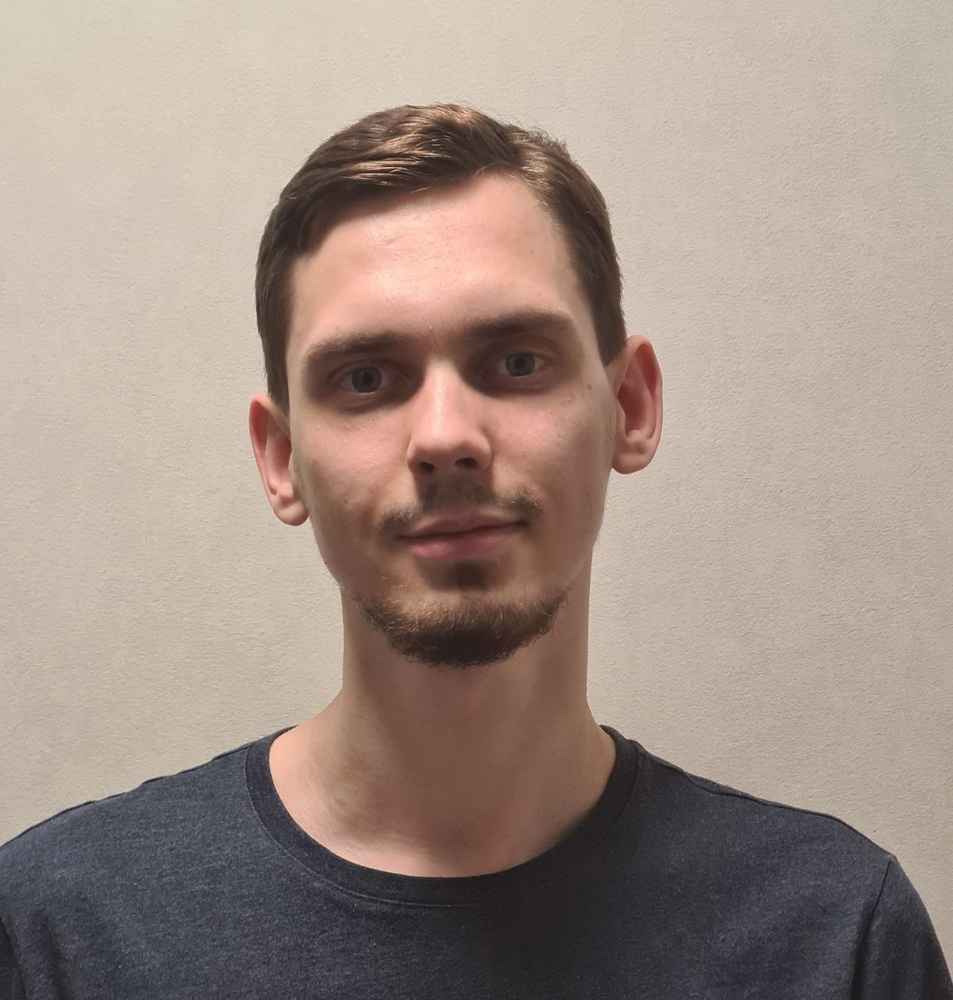

# Bocharov Dmitry

### phone number: 89161217787

## I am a driven individual with a strong determination to succeed. My ability to work collaboratively within a team, coupled with my quick learning capabilities, forms the foundation of my professional approach. Aspiring to become a frontend developer, I am committed to honing my skills.

## My Skills: I have studied CSS and HTML. I completed courses on Udemy and followed the YouTube channel "Freelancer by Life". This was about 2 years ago, but I had to stop due to family circumstances.

### Code examples: https://github.com/DeIIImos/First.git

### Education: Secondary. The courses I have taken (but not completed) include: Udemy by Ivan Petrichenko, on YouTube, htmlacademy.

### English language: I speak English a little (bit) A2